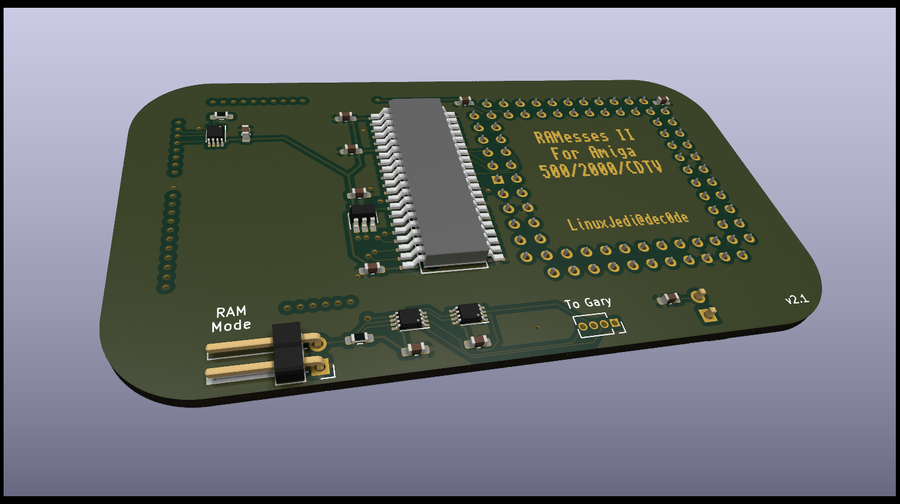

# RAMesses

RAMesses is a plug and play Amiga 500/2000/CDTV board which will convert a 2MB 8375 Agnus to work in a 512KB/1MB motherboard and add 2MB of RAM.
RAMesses has two switchable modes, the first gives the full 2MB to Chip RAM, the second gives 1MB of Chip RAM and 512KB of Pseudo-Fast RAM.
This is for compatibility with older games.

The project is in two parts, one is a board that sits in the Agnus socket and the other is a board that sits in the Gary socket, the two boards need to be linked together with a four wire cable, preferably around 20cm in length.

# BOM

## Agnus

| Designator | Component |
| ---------- | --------- |
| C1 - C9    | 100nF 0603 capacitor |
| C10        | 22nF 0603 capacitor  |
| R1         | 150R 0603 resistor   |
| R2         | 4.7K 0603 resistor   |
| U4, U5, U7 | 74LVC2G157 VSSOP     |
| U1         | Winslow W9328 PLCC Plug |
| U2         | PLCC-84 socket |
| U3         | 74AHC1G08 SOT-23 |
| U6         | GM71C18163C SOJ-42 |
| JP1, J6    | 01x02 2.54mm horizontal pin header |

Notes:
1. The W9328 has been tested with the ZC158 variant, but all other height variants should would.
2. For U6 you could also use K4F151611, K4E151611 and AS4C1M16E5. Potentially other RAM chips will work too.

## Gary

This simply requires a 48pin DIP socket and 2 strips of 24pin machined pins.

# Assembly

Hand soldering the PLCC plug is highly recommended, this seems to create a stronger bond and this will be the most physically stressed part.

The two boards should be linked using four wires of roughly 26-32AWG. The order of the four wires is the opposite on each board (1 - 4 on one board, 4 - 1 on the other).

# Usage

You need an 2MB 8375 Agnus in the PLCC socket. Known models to work are:

* 318069-18 PAL
* 318069-10 PAL
* 390544-01 PAL
* 318069-11 NTSC
* 390544-02 NTSC

Please note that there are 1MB versions of the 8375 that are not compatible. The 2MB A3000 Agnus chips are not compatible.

Put a jumper on the bottom VBB jumper pins if the Agnus chip is marked as VBB.

The jumper on the top RAM Mode will give 2MB of chip RAM, the jumper removed will provide 1MB of chip RAM and 0.5MB of Pseudo-Fast RAM.

# Sponsorship

If you like this design and use it, please consider donating so I can design more Amiga things:

* Ko-fi: https://ko-fi.com/linuxjedi
* PayPal: https://paypal.me/linuxjedi
